Nama    :   Ghufron Malik</br>
NIM     :   312210559</br>
Kelas   :   TI.22.B2</br>

Berikut adalah hasil praktikum Python - Exceptions Handling yang saya terjemahkan kedalam bahasa indonesia untuk mempermudah user dalam memahami materinya.


# Python - Exceptions Handling


### Pengertian
Pada python, ada dua fitur yang sangat penting untuk menangani kesalahan tidak terduga di dalam program dan juga menambah kemampuan debugging di dalamnya.
- Exception Handling - adalah suatu mekanisme pada python yang bertujuan untuk menangani sebuah error pada program. Error ini nantinya akan menghentikan program yang dijalankan dengan cara yang tidak normal.
- Assertion - pemeriksaan kewajaran yang dapat di aktifkan atau nonaktifkan setelah kita menyelesaikan uji pada program.

### Assertion Statement
Saat menemukan pernyataan, Python mengevaluasi ekspresi yang menyertainya, yang mana diharapkan semoga benar. Jika ekspresi salah, Python memunculkan pengecualian AssertionError.
Syntax untuk assert itu adalah :
`assert Expression[, Arguments]`
Jika pernyataan gagal, Python menggunakan ArgumentExpression sebagai argumen untuk AssertionError. AssertionError exceptions dapat ditangkap dan ditangani seperti pengecualian lainnya menggunakan try-except statement, tetapi jika dibiarkan, mereka akan menghentikan program dan menghasilkan backtrace.

### Contoh </br>
Berikut adalah fungsi yang mengubah suhu dari derajat Kelvin menjadi derajat Fahrenheit. Karena nol derajat Kelvin sedingin itu, fungsinya akan keluar jika melihat sebuah suhu negatif.
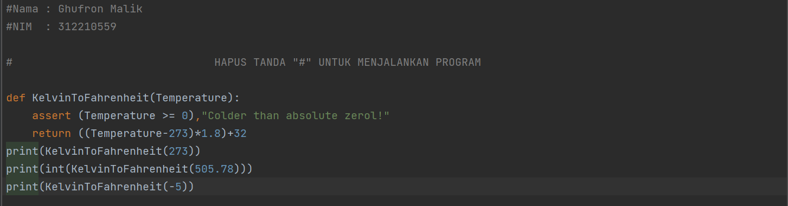

Ketika kode di atas dijalankan, menghasilkan hasil sebagai berikut -
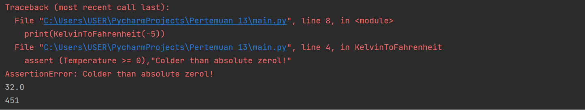


### Menangani Sebuah Pengecualian
Jika kita memiliki beberapa kode mencurigakan yang bisa memunculkan sebuah pengecualian, kita bisa mempertahankan programnya. Caranya adalah dengan menempatkan kode mencurigakan itu didalam sebuah **try:block**. Setelah try:block, masukkan sebuah **except:statement**, dibarengi dengan sebuah block kode yang menangani masalah itu dengan se-sempurna mungkin.

### Syntak
Ini adalah sebuah syntax sederhana dari *try...except...else* blocks
```py
try:
    Opetasi dilakukan disini;
   ......................
except ExceptionI:
   Jika disini adalah pengecualian1, maka blok ini akan dieksekusi.
except ExceptionII:
   Jika disini adalah pengecualian2, maka blok ini akan dieksekusi.
   ......................
else:
   Jika sama sekali tidak ada pengecualian blok ini yang akan dieksekusi.
```   

Berikut adalah beberapa poin penting tentang sintaks yang disebutkan di atas -
- Pernyataan try tunggal dapat memiliki beberapa pernyataan kecuali. pernyataan. Ini berguna saat mencoba blok berisi pernyataan yang mungkin melempar berbagai jenis pengecualian.
- Anda juga dapat memberikan klausa kecuali umum, yang menangani pengecualian apa pun.
- Setelah klausa kecuali, klausa, Anda dapat menyertakan sertakan klausa lain. lain-klausa. Kode di blok-lain-lain-blok dijalankan jika kode di try: block tidak memunculkan eksepsi.
- Blok else adalah tempat yang bagus untuk kode yang tidak memerlukan perlindungan blok try:.

### Contoh
Dicontoh ini akan membuka file, lalu menulis ini file, dan akan keluar dengan normal karena tidak ada masalah didalamnya.
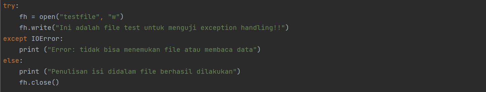

Ini menghasilkan hasil berikut -
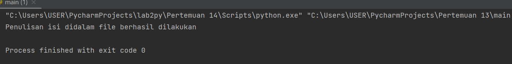

### Contoh
Dicontoh ini akan mencoba membuka sebuah file dimana kita tidak mempunyai izin untuk menulis, jadi nantinya akan memunculkan sebuah pengecualian.
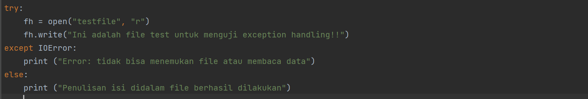

Ini menghasilkan hasil berikut -
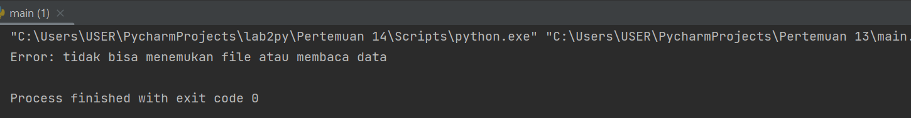


### Pengecualian tanpa Exceptions

Kita bisa menggunakan except statement dengan no exceptions yang didefinisikan seperti ini :
```py
try:
   Lakukan sebuah operasi disini;
   ......................
except:
   Jika ada sebuah pengecualian disini, maka eksekusi blok ini.
   ......................
else:
   Jika tidak ada pengecualian disini, maka eksekusi blok ini. 
   ```

Pernyataan try-except jenis ini menangkap semua pengecualian yang terjadi. Menggunakan jenis pernyataan try-exception ini tidak dianggap sebagai operasi yang baik, karena semua pengecualian ditangkap, tetapi tidak memungkinkan program untuk mengidentifikasi kemungkinan penyebab masalah.

### Pengecualian dengan beberapa Exceptions

kita bisa juga menggunakan except statement untuk mengatasi beberapa exceptions seperti ini :
```py
try:
   Lakukan sebuah operasi disini;
   ......................
except(Exception1[, Exception2[,...ExceptionN]]]):
   Jika ada pengecualian dari list yang diberikan, 
   maka eksekusi blok ini.
   ......................
else:
   Jika tidak ada, maka eksekusi blok ini.
```


### Try-finally

kita bisa menggunakan sebuah finally:block bersamaan dengan sebuah try:block. Finally Block adalah sebuah tempat untuk menempatkan kode yang harus di eksekusi, apakah try-block akan memunculkan pengecualian atau tidak.
Syntax dari try-finally statement adalah seperti ini :
```py
try:
   Lakukan sebuah operasi disini;
   ......................
   Jika ada pengecualian, ini akan dilewati.
finally:
   Ini akan selalu di eksekusi.
   ......................
```
Kita tidak bisa menggunakan else berbarengan dengan sebuah finally.


### Contoh

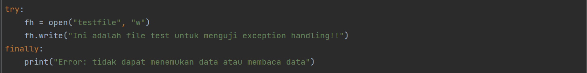
Jika Anda tidak memiliki izin izin untuk membuka file dalam mode penulisan tertulis, maka ini akan menghasilkan file
berikut hasil −

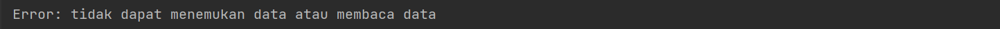

Contoh yang sama bisa ditulis lebih sempurna
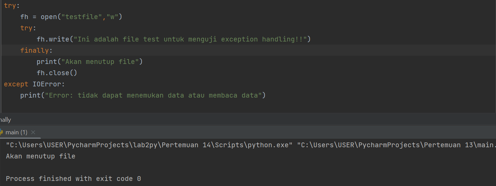

Ketika pengecualian dilemparkan ke *try-block*, eksekusi segera diteruskan ke *finally block*. Setelah semua pernyataan di blok *finally* dieksekusi, pengecualian dimunculkan lagi dan ditangani di dalam pernyataan *except* jika ada di lapisan di atas pernyataan *try-except* berikutnya.

### Argumen dari sebuah pengecualian

Jika kita menulis sebuah kode untuk mengatasi sebuah pengecualian, kita bisa mendapatkan sebuah variabel mengikuti nama dari pengecualian tersebut. Jika kita terjebak di beberapa pengecualian, kita bisa mendapatkan sebuah variabel mengikuti tuple dari pengecualiannya.
Variabel ini menerima value dari pengecualian yang sebagian besar berisi penyebab dari pengecualian. Variabelnya bisa menerima sebuah value atau beberapa value dalam bentuk sebuah tuple. Tuple ini biasanya berisi string yang error, nomor yang error, dan lokasi errornya.

### Contoh

Berikut adalah contoh untuk satu pengecualian −
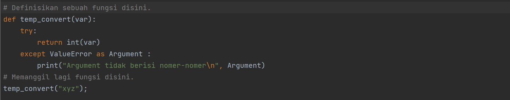

Ini menghasilkan hasil berikut -
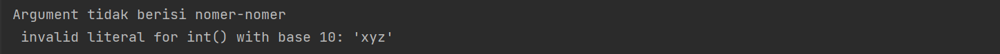


### Memunculkan sebuah Pengecualian
Kita bisa memunculkan sebuah pengecualian dengan berbagai cara menggunakan raise statement. Syntax untuk raise statement adalah sebagai berikut.
```py
raise [Exception [, args [, traceback]]]
```

### Contoh
Sebuah pengecualian bisa berupa sebuah string, sebuah class atau sebuah objek. Umumnya pengecualian yang muncul pada python adalah sebuah class, dengan sebuah argumen yang mana itu adalah turunan dari class. Mendefinisikan pengecualian yang baru sangatlah mudah dan bisa diselesaikan dengan cara seperti ini:
```py
def functionName( level ):
   if level < 1:
      raise ("Level salah!", level)
      # kode yang dibawah ini tidak akan di eksekusi
      # jika kita memunculkan sebuah pengecualian.
```

**Catatan**: Untuk menangkap sebuah pengecualian, sebuah "except" harus merujuk ke pengecualian yang sama, baik itu class object atau simple string. Untuk contoh menangkap pengecualian diatas, kita harus menulis "except" seperti ini:
```py
try:
   Logika ditempatkan disini...
except "Invalid level!":
   Exception handling disini...
else:
   Semua kode disini...
```

### Pengecualian buatan User

Python juga membebaskan kita untuk membuat pengecualian sendiri, dengan menurunkan kelas-kelas dari standar built-in pengecualian.
Berikut adalah sebuah contoh yang berkaitan ke RuntimeError. Disini, class yang dibuat merupakan subclass dari RuntimeError. Ini berguna ketika kita butuh untuk menampilkan informasi yang lebih spesifik, ketika sebuah pengecualian tertangkap.
Dalam try block, Pengecualian yang dibuat User memunculkan dan menangkap didalam except block. Variabelnya digunakan untuk membuat sebuah turunan dari class NetworkError.
```py
class Networkerror(RuntimeError):
   def __init__(self, arg):
      self.args = arg
```

Jadi ketika kita mendefinisikan class diatas, kita bisa memunculkan pengecualian dengan cara seperti ini :
```py
try:
   raise Networkerror("Bad hostname")
except Networkerror,e:
   print e.args
```


### Penutup
Itulah hasil dari program Exception yang telah saya kerjakan, jika ada kesalahan kata dalam pengetikan, Saya memohon maaf yang sebesar besarnya. Sekian dari repository ini saya buat. Saya ucapkan, Terimakasih...
# *HAVE A NICE DAY :)*